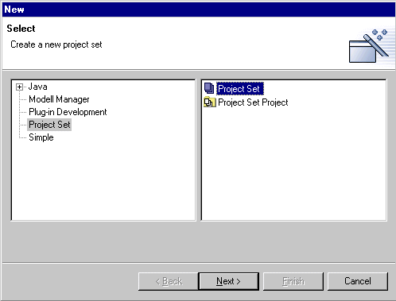
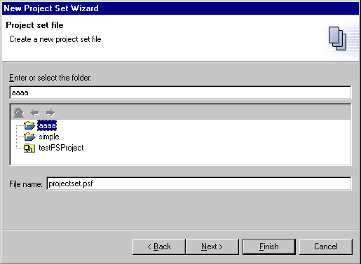
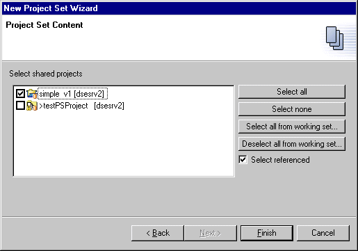
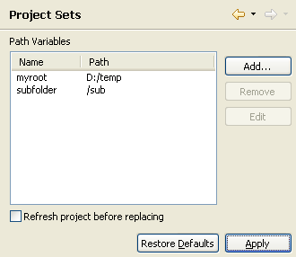
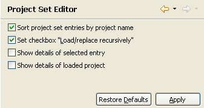
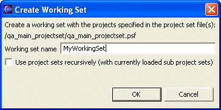

# DXC Project Set Editior

## Project Set

### Concept

A project set holds specific information needed to reconstruct a set of
projects from a team repository to the workspace. Only projects that are
shared can be part of a project set.

For example, project sets can be used to group projects for a release or
for contributing it to another person.

Project sets are stored in xml files with the file extension psf. In the
eclipse views the files are displayed with the icon
 .

The format of the project set file used by this plugin is the same that
is used in eclipse when exporting or importing team project sets.

The implementation of this plugin currently supports CVS and Git as team
repositories. Other team repository providers may be implemented as
extensions.

### Preferred Project Location

In the Project Set Editor for each project it can be
specified to which local directory it will be stored for the first time
it is loaded. If no such preferred location is specified it will be
stored to the eclipse workspace directory. If the project is already
stored to an other location, this location will be used when loading the
project.

The information about the preferred project locations is stored in an
additional file which has the same name as the project set file but with
the file extension .ppl. The .ppl file will be shown with the icon
 and will be created the first time the user
specifies a preferred project location in the project set editor and
then saves the project set.

Placeholders for path segments can be used in the preferred project
locations. The syntax to be used is \${Variablename}, for example
\"\${myroot}/subfolder\" can be set as preferred location and every user
can define his own root directory. Every variable must be defined in the
[preference page](#IDS_psfpreferences) for the project sets. The
pathvariable \${workspace} is always defined implicitly with the path to
the eclipse workspace directory. Project sets with undefined variables
can not be loaded.

### Warning!

The specified preferred local directory will be deleted before loading
the project from the team repository. Please specify always the complete
path of the directory to which the project files should be loaded. For
example if you set C:\\ as preferred local directory the hard disk will
be completely deleted !

### Note

When loading a project with a preferred local directory always the
message dialog \"The project already exists. Do you wish to overwrite
it?\", even if the project not exists before. For technical reasons this
message can currently not be suppressed. Please confirm it with \"Yes\".

### Create a project set file

To create a project set file use the menu \"File \> New \> Other\...\",
select the category \"Project Set\" and the type \"Project Set\".

The Wizard for creating a new project set has two pages.

On the first page you can specify the name of the project set file and
the destination folder.

On the second page you select the projects that will be in the project
set. Only shared projects that are loaded in the workspace can be added.
They will be added in the tag that is loaded in the workspace. This
dialog has some buttons to simplify the selection (e.g. select all
projects of a working set). If the checkbox \"Select referenced\" is on
then all referenced project will be recursively selected. The referenced
projects will not be deselected automatically if a project if
deselected.

Note: To create a project set file you can also use the menu \"File \>
Export\...\" and select \"Team Project Set\"

### Edit a project set file

To edit a project set file

-   double click on the project set file in an eclipse view **or**

-   select \"Open\" or \"Open With \> Project Set Editor \"

An Editor for the project set will then be opened. How to use this
editor is described in Project Set Editor

### Load/Replace projects from a project set

The projects referenced in a project set file can be added to the
workspace by

-   opening a project set editor on a project set file and use the
    editor functionality **or**

-   using the menu \"Load/Replace Projects\" in the context menu of a
    project set file in a eclipse view **or**

-   using the menu \"Load/Replace Projects recursively\" in the context
    menu of a project set file in a eclipse view (the meaning of
    recursive loading is explained at Project Set
    Projects) **or**

-   using the menu \"File \> Import\...\" and select selecting \"Team
    Project Set\"

If a project is already loaded in the workspace you will be asked if the
content should be overwritten.

### Remarks

Repository locations in project sets distinguish between server names
and IP addresses. This means if one user has the repository specified by
the server name and and an other user uses the IP address of the server
(or an other name for the same server) this will cause problems, e.g.
the projects will be shown to one user as \"loaded in an other version\"
although the same version of the physically same server is loaded. It is
recommended to use the server name instead of the IP address.

To avoid problems when changing the server location of a repository we
recommend to use different symbolic server names for each repository.
Each user must map the symbolic names in the hosts file to the real
server names or IP addresses. On Windows NT/2000 the hosts file is
located C:\\WINNT\\system32\\drivers\\etc.

## Project Set Projects

### Concept

A projects set project (PS project) is a specialized project with one
project set file. In the eclipse views a PS project
is shown with the icon 

Each PS project has a file named .psproject that holds the project
relative name of the project set file. When renaming the project set
file the file name in the .psproject file must be changed accordingly.

PS projects enables the user to nest project sets by using project set
projects as entries in other project sets. Project sets can then be
loaded recursively, which means that if a project set X is loaded that
contains a project Y that is also a project set project then the
projects specified in the project set file in Y are also loaded.

Project set files can be used without a PS project but then they can\'t
be nested and no error markers are
created for them.

### Conflicts

When using PS projects there can be tag conflicts. That means a project
is specified with different tags. For example a project set contains a
project X and a project Y that is a PS project that contains X with a
different tag.

Conflicts can only be detected if the PS project that contains the
conflict is loaded with the specified tag, e.g. in the above example the
conflict is not shown if the PS project Y is not loaded or loaded with a
different tag.

Analogous, there can be conflicts if different preferred folders have
been defined for one project.

### Create a project set project

To create a project set project use the menu \"File \> New \>
Other\...\", select the category \"Project Set\" and the type \"Project
Set Project\"

The wizard for a project set project automatically creates the
.psproject file and the project set file with the projects specified in
the wizard page. The name of the created project set file is the same as
the name of the project but with the extension .psf.

### Project set error markers

On changes in the workspace (e.g. changing a project set file in a
project set or loading a project) all PS projects will be checked for
errors and warnings. For every PS project only the project set file
specified in the .psproject file will be checked for conflicts and
loading state. Other project set files in the PS project are not
checked.

The messages for the errors and warnings are listed in the eclipse
\"Problems\" view and the affected resource will be marked with one of
the following icons:

-    Some of the
    projects specified in the project set are not loaded or loaded with
    a different tag

-    The project
    set contains conflicts (e.g. projects are specified in different
    tags)

-    The PS project
    has an error (e.g. the project set file specified in .psproject file
    does not exist)

### Loading projects of a PS project

To load the projects defined by the project set of the PS project use
\"Load/Replace Projects\" or \"Load/Replace Projects recursively\" from
the context menu of the PS project or the containing project set file.

## Project Set Editor

### Overview Editor

The project set editor (PSF editor) is used to edit project set
files. It has three areas

-   The table at the top shows the content of the project set

-   The area at the bottom shows details about the project set entry
    that is selected in the table

-   On the right side are the buttons for manipulating the project set

### Description of the content table

The table show the entries of the project set. It has the following
columns:

-   **Name:** The icon, name and repository information of the currently
    loaded project. Only the name if the project is not loaded.

-   **Tag:** The tag of the project in the project set. For CVS as team
    provider this is HEAD or the name of the version or branch

-   **Preferred Path Problems:** If there are problems concerning the
    preferred local directory they will be shown in this column.
    Possible problems are:

    -   The specified preferred local directory has undefined path
        variables

    -   The project is not loaded to the preferred local directory

    -   The preferred local directory is the same or inside an other
        preferred local directory

    -   Different preferred local directories are specified for one
        project (only possible when using Project Set
        Projects).

    The column displays the icon

    -    when the entry has a path problem

    -    when a sub entry has a path problem

-   **Tag Conflict:** Shows the conflicts
    if a project is referenced in different versions inside a project
    set (only possible when using Project SetProjects

    The column displays the icon

    -    when the entry has a tag conflict

    -    when a sub entry has a tag conflict

-   **State:** Displays the state of the project entry. The possible
    states are

    -    Loaded = the project is loaded with the
        tag specified by the project set

    -    Not loaded = the project is not loaded
        in the workspace

    -    Loaded different = the project
        is loaded with a different tag than specified by the project set

    -    Loaded not shared = the project in the
        workspace is not shared

-   **Provider:** The team provider for the entry. To improve clarity
    this column has the width zero, but can be resized if required.

-   **Server Location:** The server location for the entry. To improve
    clarity this column has the width zero, but can be resized if
    required.

The context menu in the table shows the same actions as on the right
side of the editor. If the project is loaded then actions normally
associated with projects such as \"Compare with\" and \"Replace with\"
are also available. The additional actions apply to the loaded version
of the project!

The entries can be sorted using the content of a column by clicking on
the header of the table column. A second click changes the order from
ascending to descending. When clicking a third time, the entries are not
sorted any more.

### Description of the details area

The area below the table shows the details of the selected entry.

At the top of this area the name of the selected entry is shown.

In the next line there is an entry field for editing the preferred local
directory for the entry. An empty entry means that the default location
in the workspace directory will be used. It is only editable for team
providers which support preferred local directory and only for root
entries. Sub entries must be edited in the project set that directly
contains them. The buttons beside the entry field have the following
functionality:

-   **Browse:** Opens a file browser for selecting a local directory

-   **Current:** Sets the preferred local directory to the directory in
    which the project is currently stored

-   **Add Var:** Opens a dialog for selection of a defined path variable
    and inserts the selected variable. (The variables must be defined at
    the preference page)

Below the entry field the tag conflicts and the problems concerning the
preferred local directory are displayed.

The two areas at the bottom display more details for the selected entry
and the loaded project. The areas can be hidden and shown by clicking
the blue triangle beside the area header. The preferred local directory
is here shown with the resolved path variables. Differences between the
entry and the loaded project are marked in red.

### Description of the buttons

The buttons for the possible actions on the right side of the editor.

-   **Load/Replace selected:** Load or replace (if already exists) the
    selected projects with the tag specified in the project set

-   **Load/Replace all:** Load or replace (if already exists) all
    projects of the project set with the tag specified in the project
    set

-   **Add:** Opens a dialog to select projects that should be added to
    the project set. Only shared projects that are not already in the
    project set are listed

-   **Remove:** Removes the selected project(s) from the project set.

-   **Set selected to loaded tag:** Set the tag of the selected entries
    to the tag the project has in the workspace

-   **Select all:** Selects all entries in the editor

-   **Select loaded:** Selects all loaded entries in the editor (also
    that are loaded in a different version than specified)

-   **Select unloaded:** Selects all entries in the editor which project
    is not loaded in the workspace

-   **Open included PSF:** Opens a new PSF editor for the project set
    file of the selected project set project

The buttons for manipulating (add, remove, change tag) are disabled if
sub entries are selected. These entries must be changed in a PSF editor
for their direct parent project. The load/replace buttons are disabled
if an entry and its parent are selected.

The checkbox \"Load/Replace recursively\" determines whether the
projects will be loaded recursively if one of the two \"Load/Replace\"
buttons is clicked. The default state of this checkbox can be set in the
preference page for the project sets.

### Saving the project set

By pressing \<CTRL\> and \"s\" or selecting \"Save project set\" from
the context menu anywhere in the editor the project set is saved. Also
when closing the editor you will be asked if the changes should be saved
to the project set file.

## Project Set Preferences

To edit the preferences for the project set use the menu \"Window \>
Preferences\" and select \"Project Sets\" on the left side. On the right
side the following page will be shown.

The list shows the defined path variables that can be used to define
preferred project locations. Variables can be added, removed or edited with the buttons beside the
list.

The option below allows to specify whether a project will be refreshed
before beingreplaced. This may be useful if the automatic refresh in
Eclipse is disabled and files are changed by external programs.
Otherwise there may be messages that warn about files that are not
synchronous to the Eclipse workspace when a project is replaced.

To edit the preferences for the project set editor select \"Project Sets
Editor\" on the left side. On the right side the following page will be
shown.

With the checkboxes the default behavior for the project set editor can
be set.

## Working Sets

A working set can be created with the content of one or more project
sets.

Select one or more project set files or project set projects and select
\"Create working set\" from the context menu. The following dialog will
be opened.

If the checkbox in the dialog is selected the working set will also
contain the projects specified in the sub project sets of the selected
project sets. Only the currently loaded sub project sets will be used.
This operation not loads any projects to the workspace.
